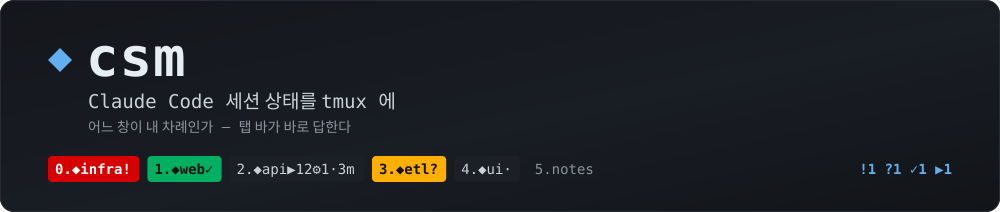
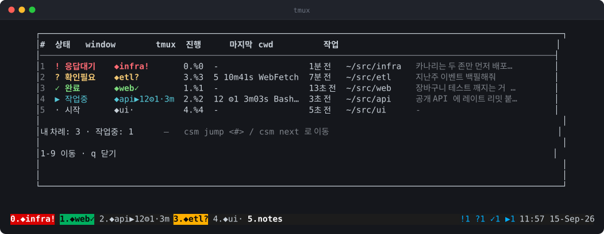
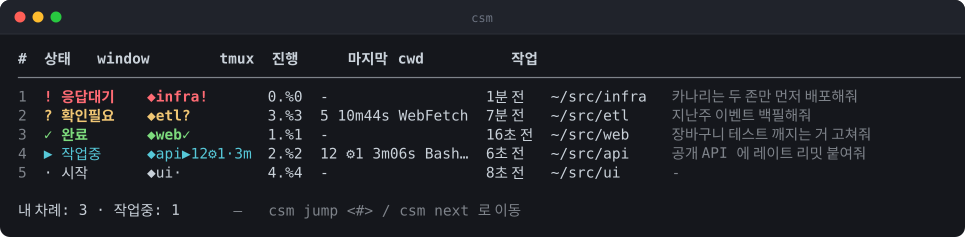

<div align="center">



[](LICENSE)


[](README.md)

</div>

여러 창에서 Claude Code 를 동시에 돌릴 때 궁금한 건 하나다. **어느 창이 내 차례인가.**
`csm` 은 그걸 tmux 창 이름과 탭 색, 그리고 화면 위에 띄우는 표로 보여준다.

<div align="center">

</div>

`C-a L` 을 누르면 시계(`C-a t`)처럼 이 표가 팝업으로 뜬다. 숫자키로 그 창으로 이동,
`q` 로 닫는다. Claude 를 폴링하지도, API 를 부르지도 않는다 — 상태는 Claude Code 가
이미 쏘고 있는 훅에서 나온다. 그래서 창 하나 확인하는 데 드는 건 시선 한 번뿐이다.

## 다섯 가지 상태

대개는 탭 바만 봐도 끝난다. 다섯 중 셋이 "내 차례"이고, 그 셋은 전부 탭에 색이 칠해진다.

<div align="center">

</div>

| 상태 | 글리프 | 뜻 | 표 | 탭 |
|---|---|---|---|---|
| 응답 대기 | `!` | 권한 요청·질문·플랜 승인 | 빨강 | 빨강 |
| 확인 필요 | `?` | 작업중인데 3분째 아무 일도 없다 | 노랑 | 노랑 |
| 완료 — 내 차례 | `✓` | 턴이 끝났다 | 초록 | 초록 |
| 작업중 | `▶` | 도구를 돌리고 있다 | 청록 | 원래색 |
| 살아있지만 기록 없음 | `·` | 떠 있지만 훅이 아직 말을 안 했다 | 회색 | 회색 |

창 이름에는 같은 내용에 이번 턴의 진행이 붙는다.
`◆api▶12⚙1·3m` 은 *api, 작업중, 도구 12회, 서브에이전트 1개, 이번 턴 3분째*.

## 설치

파일 하나면 된다. 기계에 맞는 판을 고른다.

```bash
python3 csm install      # python3 만 있으면 된다
./csm.sh install         # bash 3.2+, jq, awk, ps 가 필요하다
```

`install` 은 여러 번 돌려도 안전하고, 제 것만 건드린다.

- `~/.claude/settings.json` 에 훅 8개 등록 (다른 훅은 손대지 않는다)
- `~/.local/bin/csm` 심링크
- `~/.tmux.conf` 에 마커 블록 삽입 (`~/.tmux.conf.csm-bak` 으로 백업)
- tmux 설정 리로드

`install --check` 는 바꾸지 않고 상태만 알려준다.
`tmux-conf` 는 블록만 출력한다 — `~/.tmux.conf` 를 직접 관리한다면 이걸 붙이면 된다.

설치 후에는 Claude Code 를 새로 띄워야 한다(훅은 세션 시작할 때 읽는다).

## 사용

```bash
csm              # 표
csm next         # 내 차례인 창으로 이동 (! → ? → ✓ 순)
csm jump 3       # 3번 줄로 이동
csm watch        # 2초마다 갱신, 숫자키 이동, q 종료 (C-a L 이 이걸 띄운다)
```

<div align="center">

</div>

## 어떻게 도는가

Claude Code 는 세션·턴·도구 이벤트마다 훅을 부른다. 훅은 tmux pane 하나당 JSON 한 개를
`~/.cache/claude-tmux/` 에 쓰고, 창 이름과 탭 색을 다시 칠한다. `status-right` 는 5초마다
`csm sweep` 을 돌려, 아무 세션도 이벤트를 내지 않아도 경과시간과 "너무 조용함" 판정이
갱신되게 한다.

알아둘 만한 판단들:

- **늦게 온 완료 이벤트가 끝난 턴을 되살리지 않는다.** `PostToolUse`/`SubagentStop` 은
  `Stop` 뒤에 도착할 수 있는데, 그걸 "아직 작업중"으로 보면 끝난 창이 계속 바쁜 척한다.
- **`AskUserQuestion`/`ExitPlanMode` 는 곧바로 `!`** — 반드시 사람을 기다리는 도구다.
- **실행 중인 도구도 없이 3분 넘게 조용한 `working` 은 `?`** 로 내린다. 대개 멈춰 있고,
  ▶ 로 두면 헛되이 시선을 뺏는다.
- **캐시가 없어도 살아있는 세션은 목록에 나온다.** 훅을 달기 전에 띄웠거나 캐시가 지워진
  경우 `ps` 로 프로세스 트리를 훑어 `·` 로 붙인다. 살아있는데 안 보이는 게 제일 나쁘다.
- **캐시는 tmux 서버별로 구분한다.** 두 번째 서버에서 돌려도 첫 번째 서버의 상태를
  지우지 않는다.

## 두 판, 같은 동작

| | `csm` (python) | `csm.sh` (bash) |
|---|---|---|
| 필요한 것 | `python3` | `bash 3.2+`, `jq`, `awk`, `ps` |
| 훅 지연 | ~60ms | ~55ms |

캐시 형식과 모든 규칙을 공유하므로 어느 쪽을 깔아도 되고, 기계마다 다른 판을 써도 된다.
`./compat-test.sh` 가 전용 tmux 서버를 띄워 둘을 대조한다 — 고정된 이벤트 열을 먹인 뒤의
상태 기계, 폭 2가지 × ambiguous 설정 2가지에서의 표, 생성된 tmux 블록, sweep 결과.
**규칙을 고쳤으면 두 파일을 같이 고치고 이걸 돌려라.**

훅에서 비용은 계산이 아니라 **프로세스를 띄우는 횟수**다(fork 하나에 3~4ms). bash 판은
이벤트마다 외부 명령 7개를 띄운다. 예전 판은 94개를 띄워 470ms 였다.
`cut`/`grep`/`sort`/`basename`/`date` 를 루프 안에서 부르지 마라.

## tmux 버전

tmux 1.8 부터 동작하고, 새 버전일수록 더 보여준다.

| 기능 | 필요 버전 |
|---|---|
| 창 이름, `status-right` 요약 | 1.8 |
| 탭 색 (포맷의 `#{==:...}`) | 3.1 |
| `C-a L` 팝업 (`display-popup`) | 3.2 (그 아래는 창으로 열린다) |

`csm tmux-conf` 는 그 기계의 tmux 가 할 수 있는 것만 뱉는다.

## 참고

- 표·메시지 언어는 `$LANG` 을 따른다(`ko` 로 시작하면 한국어). `CSM_LANG=en|ko` 로 강제.
- `◆ ▶ · …` 같은 ambiguous 글자는 기본 2칸으로 센다(iTerm2 의
  *Treat ambiguous-width characters as double-width* 기준). 1칸으로 그리는 터미널이면
  `CSM_AMBIWIDTH=1`.
- `NO_COLOR=1` 이거나 파이프로 넘기면 색을 뺀다.
- `C-a L` 은 tmux 기본값 `switch-client -l` 을 대체한다. 직전 세션은 `C-a (` / `C-a )`.
- 위 그림은 목업이 아니라 실제 캡처다. `./docs/shots.sh` 가 일회용 tmux 서버를 띄워
  상태별 세션을 하나씩 채우고, 거기에 `csm` 을 돌려 나온 터미널 출력을 SVG 로 바꾼다.

## 지우기

```bash
rm ~/.local/bin/csm
```

그리고 `~/.tmux.conf` 의 `# >>> csm >>>` … `# <<< csm <<<` 블록과
`~/.claude/settings.json` 의 `csm hook` 항목을 지운다. 상태는 `~/.cache/claude-tmux/` 에 있다.

## 라이선스

MIT
