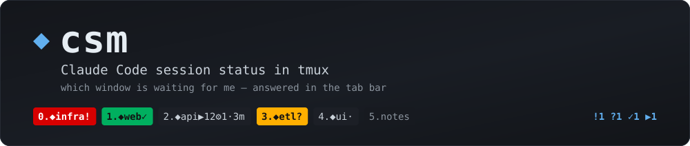
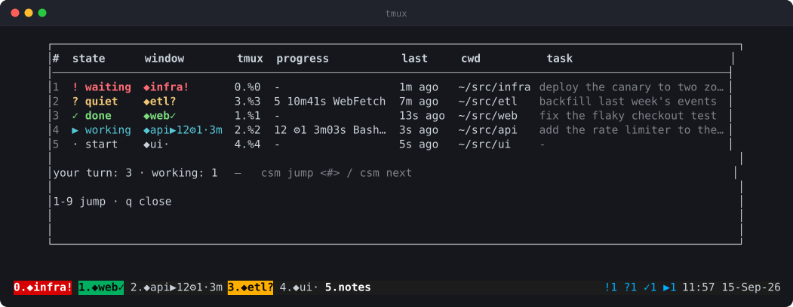
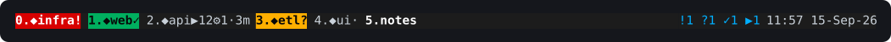
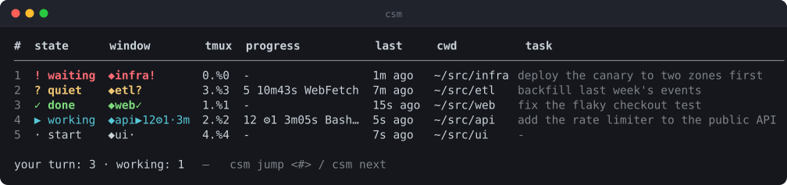

<div align="center">



[](LICENSE)


[](README.ko.md)

</div>

When you run several Claude Code sessions at once, the only question that matters is
**which window is waiting for me?** `csm` answers it in two places: the tmux window name
and tab colour, and a table you can pop up over your screen.

<div align="center">

</div>

`C-a L` opens that table in a popup (like the tmux clock on `C-a t`). Press a digit to jump
to that session's window, `q` to close. Nothing polls Claude and nothing calls an API — the
state comes from hooks Claude Code already fires, so a window costs you a glance, not a
context switch.

## The five states

The tab bar alone is usually enough: three of the five states mean *your turn*, and each
of those paints the tab.

<div align="center">

</div>

| state | glyph | means | table | tab |
|---|---|---|---|---|
| waiting for you | `!` | a permission prompt, a question, a plan to approve | red | red |
| suspiciously quiet | `?` | working, but nothing has happened for 3 minutes | yellow | yellow |
| done — your turn | `✓` | the turn finished | green | green |
| working | `▶` | tool calls in flight | cyan | unchanged |
| running, no state yet | `·` | alive, but the hooks have not spoken | grey | grey |

The window name carries the same thing plus the progress of the current turn —
`◆api▶12⚙1·3m` is *api, working, 12 tool calls, 1 subagent, 3 minutes into the turn*.

## Install

One file. Pick the edition that matches the machine:

```bash
python3 csm install      # needs python3 only
./csm.sh install         # needs bash 3.2+, jq, awk, ps
```

`install` is idempotent and touches only its own things:

- registers 8 hooks in `~/.claude/settings.json` (leaves your other hooks alone)
- symlinks `~/.local/bin/csm` to whichever edition you installed
- inserts a marked block into `~/.tmux.conf` (backs the file up to `~/.tmux.conf.csm-bak`)
- reloads tmux

`python3 csm install --check` reports what is missing without changing anything.
`python3 csm tmux-conf` prints just the tmux block if you manage `~/.tmux.conf` yourself.

Start a new Claude Code session after installing — hooks are read at session start.

## Usage

```bash
csm              # the table
csm next         # jump to the window that needs you (! → ? → ✓)
csm jump 3       # jump to row 3
csm watch        # refresh every 2s; digits jump, q quits (this is what C-a L runs)
```

<div align="center">

</div>

## How it works

Claude Code fires hooks on session/turn/tool events. Each hook writes one JSON file per
tmux pane under `~/.cache/claude-tmux/`, then re-renders every window name and tab colour.
`status-right` runs `csm sweep` every 5 seconds so elapsed times and the "quiet too long"
check stay fresh even when no session fires an event.

A few decisions worth knowing:

- **Late events don't resurrect a finished turn.** `PostToolUse` / `SubagentStop` can arrive
  after `Stop`; treating them as "still working" made finished windows look busy.
- **`AskUserQuestion` / `ExitPlanMode` go straight to `!`** — they always wait for a human.
- **A `working` session with no tool in flight and no event for 3 minutes becomes `?`**,
  not `▶`. It is usually stuck, and pretending otherwise wastes your attention.
- **Live sessions show up even with no cache file** (hooks not installed yet, cache cleared):
  `csm` walks the process tree with `ps` and lists them as `·`. Missing a live session is
  worse than showing an unknown one.
- **The cache is keyed by tmux server**, so a second tmux server can't delete the first
  one's state.

## Two editions, one behaviour

| | `csm` (python) | `csm.sh` (bash) |
|---|---|---|
| requires | `python3` | `bash 3.2+`, `jq`, `awk`, `ps` |
| hook latency | ~60 ms | ~55 ms |

They share the cache format and every rule, so you can install either one — or different
ones on different machines. `./compat-test.sh` spins up a throwaway tmux server and diffs
the two: the state machine after a fixed event sequence, the rendered table at two widths
and both ambiguous-width settings, the generated tmux block, and the sweep result.
**If you change a rule, change both files and run it.**

In a hook, cost is process spawns, not computation (a fork is 3–4 ms). The bash edition
spawns 7 externals per event; an earlier version spawned 94 and took 470 ms. Keep
`cut`/`grep`/`sort`/`basename`/`date` out of loops.

## tmux versions

Works from tmux 1.8. Newer versions get more:

| feature | needs |
|---|---|
| window names, `status-right` summary | 1.8 |
| tab colours (`#{==:...}` in formats) | 3.1 |
| `C-a L` popup (`display-popup`) | 3.2 (older versions open a window instead) |

`csm tmux-conf` emits only what your tmux can do.

## Notes

- Output language follows `$LANG` (Korean when it starts with `ko`), and `CSM_LANG=en|ko`
  overrides it. Code comments and the generated tmux block are English.
- Ambiguous-width glyphs (`◆ ▶ · …`) are counted as 2 columns by default, matching
  iTerm2's *Treat ambiguous-width characters as double-width*. Set `CSM_AMBIWIDTH=1` if
  your terminal draws them narrow.
- `NO_COLOR=1` (or piping) turns colour off.
- `C-a L` replaces tmux's default `switch-client -l`; use `C-a (` / `C-a )` for that.
- The pictures above are real captures, not mockups: `./docs/shots.sh` builds a throwaway
  tmux server, fills it with one session per state, runs `csm` against it and turns the
  terminal output into SVG.

## Uninstall

```bash
rm ~/.local/bin/csm
```

then delete the `# >>> csm >>>` … `# <<< csm <<<` block from `~/.tmux.conf` and the
`csm hook` entries from `~/.claude/settings.json`. State lives in `~/.cache/claude-tmux/`.

## License

MIT
